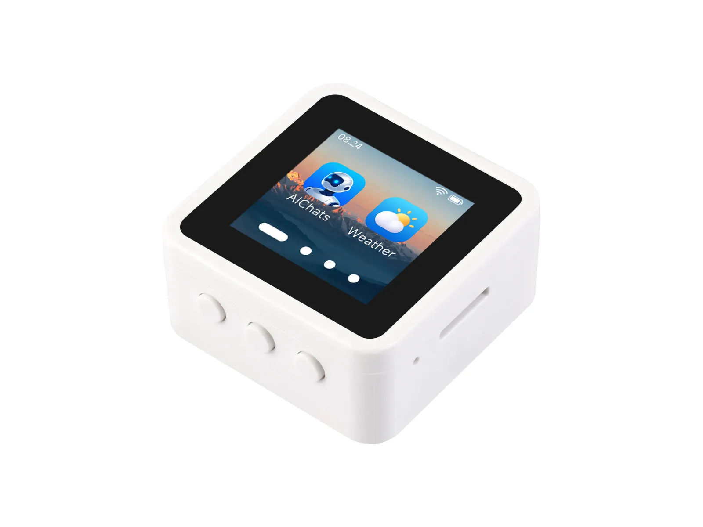

# 微雪 ESP32-S3-Touch-LCD-1.54

[English](README.md)

ESP32-S3-Touch-LCD-1.54 是一款小巧、高性能的开发板，采用 ESP32-S3R8（双核 Xtensa LX7，主频高达 240 MHz，配备 8 MB PSRAM 和 16 MB Flash），支持 2.4 GHz Wi-Fi 和 Bluetooth 5 LE。板载 1.54 英寸 240 × 240 电容触控 LCD、音频模块（ES8311 + ES7210）、QMI8658 六轴惯性传感器、RTC、TF 卡槽、USB Type-C 接口和电池接口，适用于 LVGL 图形界面、语音交互、可穿戴设备及其他物联网应用。

- [购买链接](https://www.waveshare.com/esp32-s3-touch-lcd-1.54.htm)
- [产品文档](https://docs.waveshare.net/ESP32-S3-Touch-LCD-1.54)



## 仓库结构

本仓库提供 ESP32-S3-Touch-LCD-1.54 和 ESP32-S3-LCD-1.54 的示例程序及出厂固件。

```text
.
├── examples/        # ESP-IDF 和 Arduino 示例程序
├── Firmware/        # 预编译的出厂及示例固件（.bin）
└── assets/          # 文档使用的图片
```

## 快速开始

预编译固件位于 [`Firmware/`](Firmware) 目录。有关开发环境搭建、固件烧录、引脚定义和配置方法，请参阅[产品文档](https://docs.waveshare.net/ESP32-S3-Touch-LCD-1.54)。

## 参与贡献

欢迎参与贡献！您可以通过以下方式提供帮助：

1. Fork 本仓库。
2. 为新功能或问题修复创建分支。
3. 提交修改并填写清晰的说明。
4. 提交 Pull Request 以供审核。

## 问题与支持

如遇问题，请在 [Issues](https://github.com/waveshareteam/ESP32-S3-Touch-LCD-1.54/issues) 中提供详细信息，或携带订单号联系微雪团队获取技术支持。

## 许可证

本项目采用 Apache License 2.0 许可证，详情请参阅 [LICENSE](LICENSE) 文件。

---

感谢您使用微雪电子产品！
